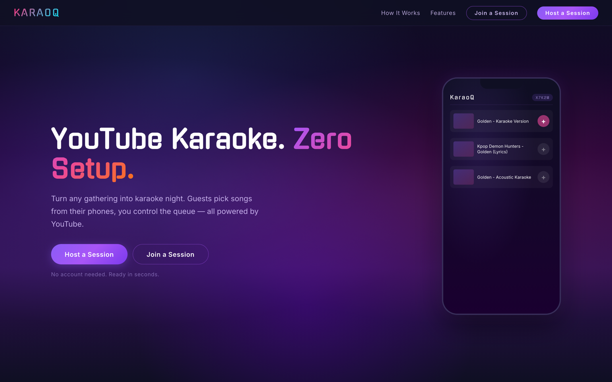

<div align="center">

# karaoq

### YouTube Karaoke. Zero Setup.

Turn any gathering into karaoke night. A host creates a room and shares a 5-character code; guests search YouTube and queue songs from their phones — no downloads, no DJ software, no hardware. Just a screen and a join code.

[](https://karaoq.live)




</div>

> **Built on** the open-source [hack-in-the-heights/karaoq](https://github.com/hack-in-the-heights/karaoq) project. My work here re-architected the realtime layer (swapped Pusher for serverless-friendly polling), moved persistence to MongoDB Atlas, and added the host/singer flows documented below. See the **Trade-offs** and **What I'd Do Differently** sections for the engineering decisions behind it.

## Features

- **Host a room** — generate a room code, display the current song and queue on a TV or laptop
- **Join from any device** — enter the code on your phone to search and queue songs
- **YouTube search** — find any song on YouTube with embeddable video playback
- **Live queue** — singers see the current song, upcoming queue, and their position in real time (3s polling)
- **Next song control** — host advances through the queue at their own pace
- **Persistent singer names** — usernames saved to localStorage across sessions
- **Confirmation modal** — review your song choice before adding to the queue
- **Toast notifications** — visual feedback when a song is added

## Architecture

```
pages/
  index.tsx                 Home — create or join a room
  host/[joinCode]/          Host view — video player + queue sidebar
  sing/[joinCode]/          Singer view — search, queue, now playing
  api/queue/[id]/
    index.ts                GET room / POST create room
    videos.ts               POST add song to queue
    position.ts             POST advance active song index

components/
  Home.tsx                  Room creation and join logic
  Host.tsx                  Host UI — YouTube embed, queue, controls
  Sing.tsx                  Singer UI — search, add, queue display

app/queue/
  createRoom.ts             Client-side API wrapper — create room
  getRoom.ts                Client-side API wrapper — fetch room
  postEntryToQueue.ts       Client-side API wrapper — add song
  updatePosition.ts         Client-side API wrapper — advance queue

styles/                     CSS Modules (dark theme)
```

**Data flow:** Components call client wrappers (`app/queue/`) which hit Next.js API routes (`pages/api/`). API routes connect directly to MongoDB. Both host and singer views poll the room endpoint every 3 seconds for updates.

**Data model:**

```
Room {
  id: string                 // 5-char alphanumeric code (e.g. "K4MNP")
  queue: QueueEntry[]        // ordered list of songs
  activeVideoIndex: number   // index of the currently playing song
}

QueueEntry {
  id: string                 // UUID v4
  userName: string           // singer's display name
  songTitle: string          // YouTube video title
  videoId: string            // YouTube video ID
}
```

## Tech Stack

| Layer | Choice | Rationale |
|-------|--------|-----------|
| Framework | Next.js 14 (Pages Router) | SSR landing page, API routes colocated with frontend, Vercel-native deployment |
| Database | MongoDB Atlas (free tier) | Document model fits room/queue data naturally; 512MB free tier is generous for this use case |
| Video | YouTube Data API v3 | Unlimited song catalog, embeddable player, free quota (10k units/day) |
| Styling | CSS Modules | Component-scoped styles, zero runtime cost, no build config needed |
| Sync | Polling (3s) | Serverless-friendly, no WebSocket infrastructure. 3s latency is imperceptible during karaoke |
| IDs | uuid v4 | Collision-resistant queue entry IDs without a database sequence |
| Language | TypeScript (strict) | Type safety across API boundaries, client wrappers, and components |
| Deploy | Vercel | Zero-config Next.js hosting, serverless API routes, automatic preview deploys |

## Local Development

**Prerequisites:** Node.js 18+, pnpm, a MongoDB Atlas cluster, a YouTube Data API key

```bash
git clone https://github.com/annaPerdomo/karaoq.git
cd karaoq
pnpm install
```

Copy `.env.example` to `.env.local` and fill in your credentials:

```
MONGODB_URI=mongodb+srv://...
MONGODB_DB=karaoq
YOUTUBE_API_KEY=AIza...
```

```bash
pnpm dev          # http://localhost:3000
pnpm build        # production build
pnpm lint         # ESLint
```

## How It Works

1. **Host** visits the home page and clicks CREATE — a 5-character room code is generated (ambiguous characters like `0/O`, `1/I/L` are excluded)
2. Room is created in MongoDB via `POST /api/queue/{code}`
3. Host screen shows a YouTube embed for the current song, a "Now Playing" banner, and an "Up Next" sidebar
4. **Singers** visit the home page and enter the room code — they're routed to `/sing/{code}`
5. Singers enter their name (persisted to localStorage), search YouTube, and tap a result to open the add-song modal
6. Confirmed songs are appended to the room's queue via `POST /api/queue/{code}/videos`
7. Both views poll `GET /api/queue/{code}` every 3 seconds to stay in sync
8. Host clicks "Next Song" to advance `activeVideoIndex` via `POST /api/queue/{code}/position`

## Trade-offs

- **Polling over WebSockets** — The original implementation used Pusher for real-time updates. Replaced with 3-second polling to eliminate external service dependencies and stay compatible with serverless deployment. Karaoke has natural pauses between songs, so 0-3s latency isn't noticeable. Upgrade path to SSE exists if needed.
- **Pooled MongoDB client** — A cached client singleton on `globalThis` reuses one connection per serverless instance instead of opening a fresh TCP+TLS handshake per request.
- **Server-side YouTube search with caching** — Searches proxy through `/api/search`, keeping the API key out of the browser bundle. Results are cached in MongoDB for 24h (TTL index), so repeated queries don't burn the 10k-unit daily quota; Invidious serves as a fallback when the quota runs out.
- **No auth** — Currently stateless by design. Singers are identified by a self-reported name in localStorage. Works for trusted groups (friends at a party). Auth is the next planned addition.
- **CSS Modules over a component library** — Keeps the bundle small and avoids framework lock-in. Will migrate to a design system (MUI or similar) when theming and venue branding features require it.

## What I'd Do Differently

- **App Router from day one** — Pages Router works but App Router is the future of Next.js and offers better layouts, loading states, and server components.
- **Connection pooling** — Should have cached the MongoDB client across requests from the start instead of connect/close per request.
- **API route middleware** — Rate limiting and input validation should have been set up before any feature work, not after.
- **E2E tests from the first feature** — The happy path (create room → join → search → queue → play → next) is a natural Playwright test. Should have existed before the first PR.
- **Design tokens** — Should have established spacing, color, and typography tokens before writing any CSS. Would make future theming much cleaner.

## Roadmap
 Key phases:
1. Optional auth (NextAuth.js + Google)
2. Song history and favorites for authenticated singers
3. Queue fairness (round-robin rotation, wait time estimates)
4. Organizer dashboard (event history, analytics, QR codes)
5. Social features (crowd reactions, duets, encore votes)
6. Venue tier (branding, recurring events, tip jar, TV display mode)

## License

Private
